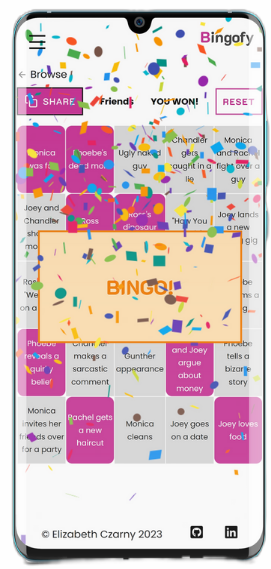

# Bingofy
Bingofy is a MERN (MongoDB, Express, React, Node.js) stack application that allows users to create custom bingo boards and play them.
<p align="center">

</p>
## Frontend
The frontend of the app is built with HTML, CSS, JavaScript, React, Redux, Redux Toolkit, React DOM, React Router DOM, React Toastify, React Icons, and Axios.

#### Getting started
To install the dependencies, run the following command:
```
npm install
```

To start the app, run the following command:
```
npm run start
```

#### Features
- Routing through "My Boards" page
- Login, register, and logout functionality
- Play page to play the game
- Ability to shuffle the location of the bingo cells
- Reset a started game

#### Folder structure
The folder structure of the frontend is as follows:

```
├───app
│       store.js
│
├───components
│   │   CellAdder.jsx
│   │   TagAdder.jsx
│   │
│   ├───BoardForm
│   │       BoardForm.css
│   │       BoardForm.jsx
│   │
│   ├───BoardItem
│   │       BoardItem.css
│   │       BoardItem.jsx
│   │
│   ├───GameBoard
│   │       GameBoard.css
│   │       GameBoard.jsx
│   │
│   ├───Header
│   │       Header.css
│   │       Header.jsx
│   │
│   └───Spinner
│           Spinner.css
│           Spinner.jsx
│
├───features
│   ├───auth
│   │       authService.js
│   │       authSlice.js
│   │
│   └───boards
│           boardService.js
│           boardSlice.js
│
└───pages
        CreateBoard.jsx
        Game.jsx
        Login.jsx
        MyAccount.jsx
        MyBoards.jsx
        Play.jsx
        Register.jsx
```


## Backend
The backend of the app is built with Node.js, Express.js, MongoDB, Mongoose, Bcrypt.js, Express-async-handler, and JWT.

#### Getting started
```
npm install
```
To start the server, run the following command:
```
npm run server
```

#### Features
- User registration and login
- Password encryption
- CRUD (Create, Read, Update, Delete) functionality

#### Folder structore
The folder structure of the backend is as follows:


```
│   cors.json
│   package-lock.json
│   package.json
│   render.yaml
│   server.js
│
├───config
│       db.js
│
├───controllers
│       boardsController.js
│       userController.js
│
├───middleware
│       authMiddleware.js
│       errorMiddleware.js
│
├───models
│       boardModel.js
│       userModel.js
│
└───routes
        boardRoutes.js
        userRoutes.js
```

#### Database schema
- User schema: a user has an ID, name, email, and password
- Board schema: title, category, array of cells, array of tags, user reference, ID, private attribute, and active cells array
